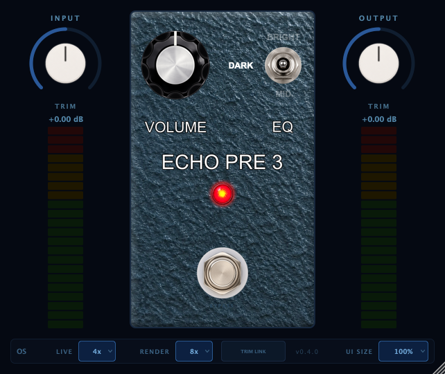

# Echo Pre 3


[](https://opensource.org/license/agpl-v3)
[](https://somsubhra.github.io/github-release-stats/?username=tehguitarist&repository=EchoPre3&page=1&per_page=30)

Echo Pre 3 is a circuit-level emulation of the Echoplex EP-3 preamp (AU/VST3), traced from the
**Chase Tone Secret Preamp** schematic. It's a single-JFET, high-headroom clean preamp — no
clipping diodes anywhere in the signal path — so the entire character comes from a 2N5457
common-source gain stage and a three-position source-bypass tone switch, both solved sample by
sample as a [Wave Digital Filter](https://en.wikipedia.org/wiki/Wave_digital_filter) network
rather than curve-fit.

> Echo Pre 3 is an independent circuit emulation built from schematic analysis and is not
> affiliated with or endorsed by Echoplex, Oberheim, or Chase Tone.



## Status

The DSP chain is fully wired end-to-end and host-verified (`auval -v aufx Ep3p Lprc` passes,
plugin runs clean in a real host). Every linear stage matches its analytic transfer function to a
fraction of a dB and a fraction of a degree; the JFET stage's `gm` and both tone-shelf time
constants are fitted from reference NAM captures of three physical units, not guessed from a
datasheet. **What's still open:** absolute input/output level calibration (`kInputRef`,
`kOutputMakeup`) and full reference validation against real-pedal captures are blocked on a couple
of additional recordings (a within-rig VOLUME sweep and a bypass anchor) — see
[`CLAUDE.md`](CLAUDE.md) for the detailed log. Until then, treat the shaper's absolute drive level
and the VOLUME taper's exact shape as provisional; everything else described below is measured.

## Overview

The signal path is one gain stage: `input LPF → JFET common-source stage (2N5457) → 3-way
source-bypass tone switch → coupled output/VOLUME network`. There's no VREF divider and no
op-amps — the JFET self-biases off a 22 V charge-pumped rail, and its square-law curvature is the
only nonlinearity in the circuit. `chowdsp_wdf` has no native JFET element, so the gain stage is a
fitted Norton-source model (current out, not voltage out — a degenerated common-source stage is a
current source) with an independently-verified implicit solve backing the fit.

A few things this pedal's build surfaced that were worth solving properly rather than
approximating:

- **The MODE switch's "brighter" position isn't a bigger shelf, it's a lower one.** Both cap
  positions reach the same HF plateau; they only differ in where the lift starts. Fitting that
  shelf (rather than reading a plateau off an FFT) also caught that the switch's own printed
  labels were backwards.
- **Degeneration suppresses distortion twice, not once.** The same feedback network that sets the
  JFET's gain also filters the second-harmonic product it generates — missing the second pass was
  worth 16 dB of excess distortion, and only an independent implicit solve of the transistor
  equation caught it; every linear frequency-response test passed the whole time.
- **A source-port WDF read silently inverted the input network's polarity.** Magnitude was
  perfect at every frequency; only a phase/DC-step check caught the missing 180°, which would have
  cancelled the JFET's own inversion and left the plugin backwards.
- **The low-OS top-octave droop is derived, not fitted.** A trapezoidal-cap WDF is the bilinear
  transform of its own analog prototype, so the correction shelf's coefficients fall out of that
  transfer function in closed form and self-scale to whatever sample rate the host supplies.

## Features

- **Single fitted JFET gain stage** — 2N5457 common-source stage with a measured transconductance
  and a two-stage shelf structure (drive shelf + a second shelf on the shaper's nonlinear excess)
  that reproduces the circuit's own double degeneration
- **Three-position MODE switch** (Bright / Dark / Mid) — three precomputed source-bypass
  topologies, each a fitted first-order shelf against the un-bypassed stage
- **Non-monotonic VOLUME control**, faithfully reproduced — the pot grounds its wiper and shunts
  both node E and OUT, so gain rises to a peak around 1–2 o'clock and genuinely falls back past
  it, exactly as the original EP-3's volume wiring does
- **Oversampling on the linear-phase FIR path** (1×/2×/4×/8×, separate live/render factors) with a
  closed-form low-OS top-octave droop restore, so the base-rate response tracks the oversampled
  one instead of needing a high factor to sound right
- **ADAA implemented and measured, shipped off** — proven exact against an independent Simpson
  integral; left disabled because at this pedal's operating point it costs more wanted second
  harmonic than the alias floor it buys back (see `docs/build-plan.md` §9 for the measurements)
- **Calibrated I/O** — input and output trim with VU-style metering, Trim Link to hold overall
  loudness while pushing drive
- **True bypass** with a crossfade and a deterministic oversampler reset, so post-bypass output
  never depends on how long the pedal was off
- **Resizable UI** from 50% to 250%, remembered per session

## Where to find things

```
src/
  PluginProcessor.{h,cpp}    Plugin entry point, parameter layout, processBlock
  PluginEditor.{h,cpp}       Top-level UI layout
  ui/PedalFace.{h,cpp}       The one-knob-plus-switch centre pedal face
  dsp/
    InputNetwork.h             Input LPF / gate-bias network
    JfetStage.h                 The fitted 2N5457 common-source stage + MODE shelves
    OutputNetwork.h             Coupled output/VOLUME network (not a simple divider)
    OsDroopRestore.h             Derived low-OS top-octave shelf
    EchoPreDsp.h                 Wires the stages into the full signal chain
  utils/TaperUtils.h          Potentiometer taper curves

tests/                      Per-stage validation executables (frequency response + phase,
                            JFET shelf/shaper checks, bypass click, oversampling fidelity)
analysis/                   Offline render tool + Python harness used to compare the plugin
                            against reference NAM captures (FR, THD, phase, compression, null)
schematics/                 Source schematic images

.claude/rules/              Detailed circuit/DSP/architecture/UI/build references — read
                            circuit.md for the full component-by-component schematic breakdown
                            and every measurement that fed the fitted constants above
```

## Building

Requires CMake 3.15+, a C++17 compiler, and the JUCE, chowdsp_wdf, and xsimd submodules
(xsimd accelerates the WDF matrix math). Builds as an Audio Unit + VST3 on macOS, VST3 on
Windows/Linux.

```bash
git clone --recurse-submodules https://github.com/tehguitarist/EchoPre3
cd EchoPre3
cmake -B build -DCMAKE_BUILD_TYPE=Release
cmake --build build --target EchoPre3_AU    # macOS only
cmake --build build --target EchoPre3_VST3  # all platforms
```

The AU is copied into `~/Library/Audio/Plug-Ins/Components/` automatically after the build.
Logic caches AU components — bump the project `VERSION` in `CMakeLists.txt` to force a rescan.
Validate without opening a DAW:

```bash
auval -v aufx Ep3p Lprc
```

### Running the test suite

Each circuit stage has a standalone validation executable checked against an analytic transfer
function, an independent implicit solve, or a known-answer probe derived from the circuit itself.
They're registered with CTest, so the whole suite runs as one pass/fail gate — this is also what
CI runs on every push/PR:

```bash
cmake --build build
ctest --test-dir build --output-on-failure
```

### Performance

CPU usage (% of realtime, stereo, 4 s render) and algorithmic latency at each oversampling factor,
measured by `PerfBenchmark` (`tests/PerfBenchmark.cpp`) on an Apple Silicon Mac, Release build.
MODE has negligible effect on CPU; figures will vary by machine. ADAA is measured but shipped off
(see Features above).

| OS factor | CPU % of realtime | Latency (samples) | Latency (ms @ 48 kHz) |
|-----------|-------------------:|-------------------:|-----------------------:|
| 1×        | ~0.4%              | 0                   | 0.00                   |
| 2×        | ~1.3%              | 49                  | 1.02                   |
| 4×        | ~2.0%              | 60                  | 1.25                   |
| 8×        | ~3.5%              | 64                  | 1.33                   |

Bypass is a flat **~0.10%** at every factor (the DSP chain, including the oversampler, is skipped
rather than run and crossfaded).

## License

Echo Pre 3 is licensed under the [GNU Affero General Public License v3.0](LICENSE) (AGPLv3).

## Credits

Built by Leigh Pierce, using:

- [JUCE](https://juce.com/) — plugin framework and UI toolkit
- [chowdsp_wdf](https://github.com/Chowdhury-DSP/chowdsp_wdf) — Wave Digital Filter modelling
  library
- [xsimd](https://github.com/xtensor-stack/xsimd) — SIMD acceleration for the circuit's matrix
  math

See also [Tommy](https://github.com/tehguitarist/Tommy), an overdrive plugin built the same way.
